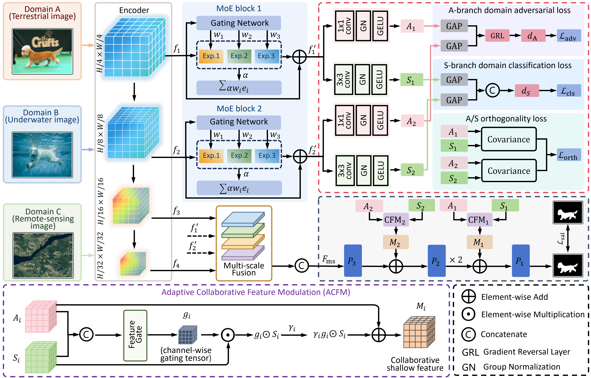

# DSS-USOD
Source code for our paper **[OmniSOD: Cross-Domain Salient Object Detection via Collaborative Domain-Invariant and Domain-Specific Representation Learning]**.

Created by **Lin Hong**, email: eelinhong@ust.hk

---

## Overview
Cross-domain salient object detection (SOD) aims to learn a unified model that
can generalize across terrestrial, underwater, and aerial environments. This
capability is important for robotic systems deployed under diverse operating
conditions. However, directly training a shared SOD model with
multi-domain data often suffers from cross-domain conflicts, where
domain-dependent appearance variations may bias feature learning toward
domain-specific patterns and weaken the extraction of transferable saliency
cues. To address this problem, this paper proposes OmniSOD, a cross-domain SOD model
based on collaborative learning of domain-invariant and domain-specific
representations. 
The [trained model](https://pan.baidu.com/s/1XrjVo-3aIjtz1we7VyYhsw?pwd=USOD) (Baidu Netdisk, fetch code: OmniSOD) or [Google Drive version](https://drive.google.com/file/d/1SMGjuNXauvSFUt9BW4tg6rtq0ZBsbTKm/view?usp=sharing) can be downloaded.

### Requirements
- Python 3.11
- PyTorch 2.5.0+cuda124
- TorchVision 0.20.0+cuda124
- Numpy 2.2.6

---
### Model Training & Inference
## Train Your Own Model
1. Download the DUTS、USOD10K、and ORSI-4199 dataset and place it in the `data` folder.
2. Update the `datapath` config to your local dataset path.
3. Run training:
   `python train.py`

## Inference with Pre-trained Model
1. Download the trained model checkpoint and place it in the `checkpoints` folder.
2. Run inference:
   `python inf.py`
---
## Benchmark
Here is the qualitative evaluation of the 30 SOTA methods and the proposed OmniSOD model on three datasets.

### Available Resources
1. **Predicted saliency maps of OmniSOD**  
   Baidu Netdisk: [Link](https://pan.baidu.com/s/1ighRFyIl1ci-BAeVBCk4Ng?pwd=USOD) | Fetch code: OmniSOD  
   Google Drive: [Link](https://drive.google.com/file/d/1-XTSrWKnb4Yg2ysFrr4asPQFWbsK0AW6/view?usp=sharing)

2. **Saliency maps of 10 representative methods on USOD10K**  
   Baidu Netdisk: [Link](https://pan.baidu.com/s/1QHF8izDaJkkhQvW5KqKv1Q?pwd=USOD) | Fetch code: OmniSOD  
   Google Drive: [Link](https://drive.google.com/file/d/1FgXQrILBG4Ei_q6gLOpRipT1swEMBPWa/view?usp=sharing)

3. **Saliency maps of 10 representative methods on DUTS**  
   Baidu Netdisk: [Link](https://pan.baidu.com/s/1nUhnoz05ylUvwSupblGCMA?pwd=USOD) | Fetch code: OmniSOD  
   Google Drive: [Link](https://drive.google.com/file/d/1xpcD2gDxMIWbq8b0y5AtIm9f6D7x2c2h/view?usp=sharing)

4. **Saliency maps of 10 representative methods on ORSI-4199**  
   Baidu Netdisk: [Link](https://pan.baidu.com/s/1nUhnoz05ylUvwSupblGCMA?pwd=USOD) | Fetch code: OmniSOD  
   Google Drive: [Link](https://drive.google.com/file/d/1xpcD2gDxMIWbq8b0y5AtIm9f6D7x2c2h/view?usp=sharing)

---

## Acknowledgements
We thank the developer of the 30 representative methods for providing their saliency maps, which greatly facilitated our benchmark evaluations.
The authors would like to express their sincere gratitude to Dr. Sanqing Qu for his valuable suggestions and insightful discussions.

---

## Note to Active Participants
This paper investigated cross-domain SOD and proposed
OmniSOD, a unified collaborative representation learning framework for
terrestrial, underwater, and aerial scenarios. Your contributions and feedback are welcome!

